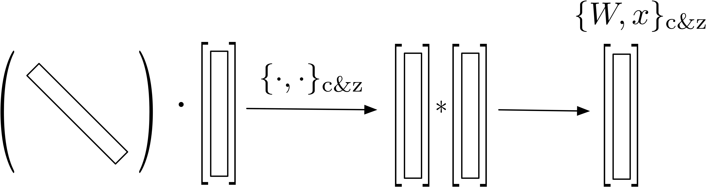

# Dr. of Crosswise

Doctor of Crosswise: Reducing Over-parametrization in Neural Networks.

For more details about the publication, visit the website:

  www.decurto.tw

If you find this example useful, please cite the paper below:

        @article{Curto19,
          author = "J. D. Curt\'o and I. C. Zarza and K. Kitani and I. King and M. R. Lyu",
          title = "Doctor of Crosswise: Reducing Over-parametrization in Neural Networks",
          journal = "arXiv:1905.10324",
          year = "2019",
        }

To run the code, enter the given folder and run:

	$ pip3 install -U scikit-learn

	$ python c_and_z.py

--------------------------------------------------------
File Information
--------------------------------------------------------

- c_and_z.py
  - Toy example demonstrating the use of the newly developed operand. A network motivated by <a href="github.com/curto2/mckernel">McKernel</a> is used. Weights are kept random, for simplicity.
